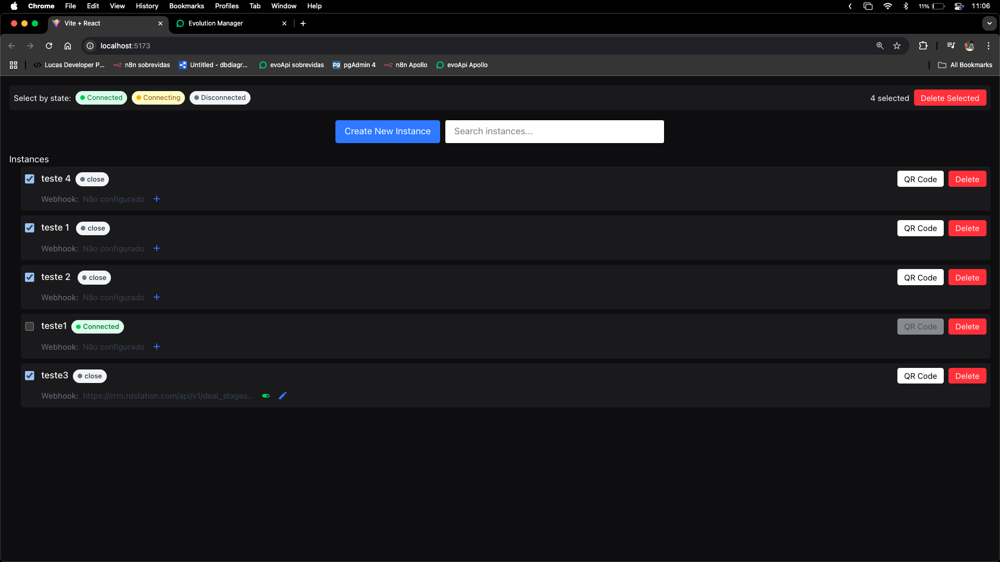
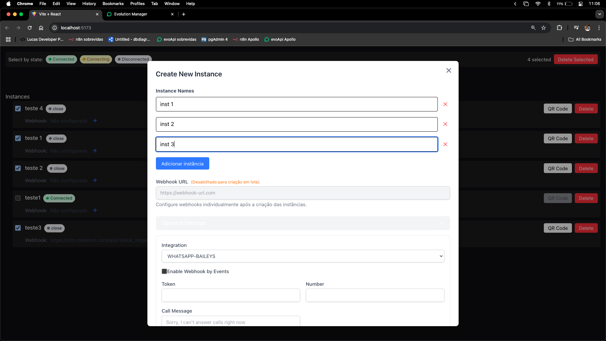
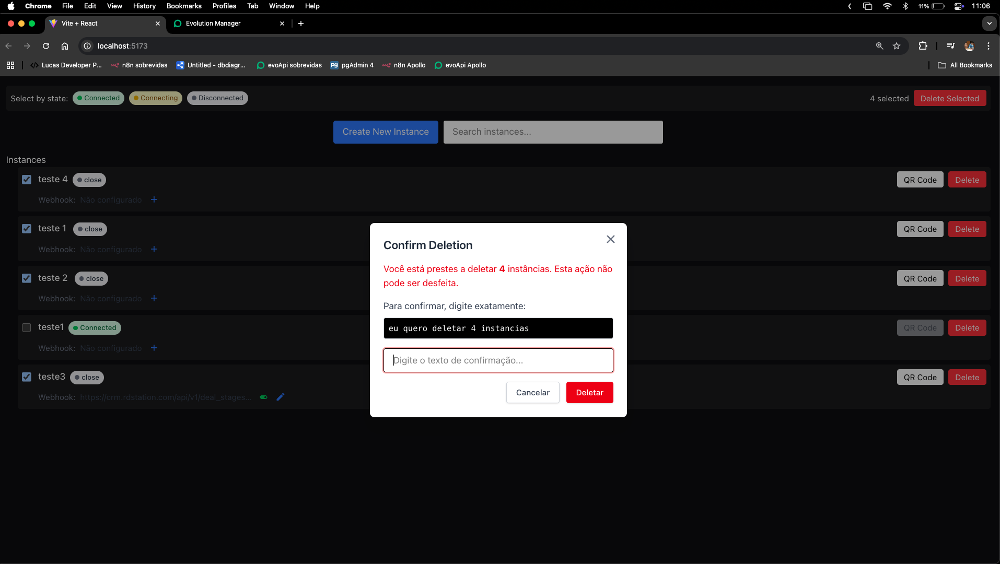

# Middleware Evolution

A middleware application for the Evolution API that facilitates communication between your applications and the Evolution API. The main benefit of this implementation is that it allows you to create or delete multiple instances at the same time.




## Features

- **Multiple Instance Management**: Create or delete multiple WhatsApp instances simultaneously
- Seamless integration with Evolution API
- Simplified API request handling
- API key authentication management
- Customizable port configuration


## Installation

### Prerequisites

- Node.js (v14 or higher)
- npm 

### Steps

1. Clone the repository:

```bash
git clone https://github.com/Luucasgontijo/middleware-evolution.git
cd middleware-evolution
```

2. Install dependencies:

```bash
npm install
# or
yarn install
```

3. Configure environment variables:

```bash
cp .env.example .env
```

4. Edit the `.env` file with your specific configuration.

5. Start the middleware:

```bash
npm run dev
```

## Configuration

Create a `.env` file based on the provided `.env.example`:

```
# Evolution API Configuration
EVOLUTION_API_URL=http://your-url
API_PORT=:XXXX
EVOLUTION_API_KEY=your_api_key_here
```

### Configuration Parameters

- `EVOLUTION_API_URL`: The URL of your Evolution API instance
- `API_PORT`: The port on which the middleware will run
- `EVOLUTION_API_KEY`: Your API key for authentication with Evolution API

## Project Structure

### Go Files

This project is implemented in Go. The main Go files include:

- `main.go`: The entry point of the application that initializes the server
- `handlers/`: Contains all HTTP request handlers
- `services/`: Business logic for interacting with the Evolution API
- `models/`: Data structures used throughout the application
- `config/`: Configuration loading and management
- `middleware/`: HTTP middleware functions for authentication, logging, etc.

To build the Go application:

```bash
go build -o middleware-evolution
```

To run the compiled binary:

```bash
./middleware-evolution
```

Or, run:

```bash
go run main.go
```

## Usage

Once the middleware is running, you can connect your applications to it. The middleware will handle authentication and communication with the Evolution API.

Example API call through the middleware:

```bash
curl -X GET http://localhost:PORT/your-endpoint \
  -H "Authorization: Bearer YOUR_TOKEN"
```

## Interface Screenshots

Here are some screenshots of the middleware in action:






## License

[MIT](LICENSE)
